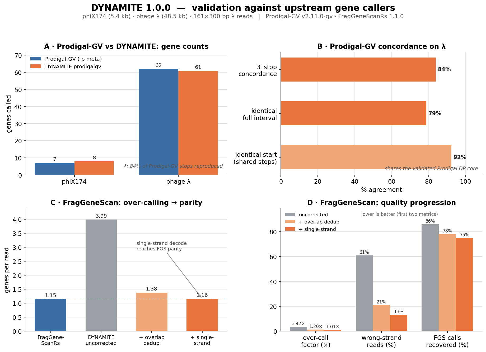

<div align="center">

```
                                                      _.-^^~~~~~^^-._
                                                  _.-~ ░░▒▒▓▓▓▓▒▒░░ ~-._
                                                .'  ░▒▓████████████▓▒░  '.
                                               ( ░▒▓██████████████████▓▒░ )
                                                '._ ░▒▓████████████▓▒░ _.'
                                                   '~-.░▒▓██████▓▒░.-~'
 ______   ___   _    _    __  __ ___ _____ _____      \ ░▒▓███▓▒░ /
|  _ \ \ / / \ | |  / \  |  \/  |_ _|_   _| ____|      \ ▒▓███▓▒ /
| | | \ V /|  \| | / _ \ | |\/| || |  | | |  _|   ╭──╮  \░▒▓█▓▒░/
| |_| || | | |\  |/ ___ \| |  | || |  | | | |___  ││▒▓██╼╾╼ ✸
|____/ |_| |_| \_/_/   \_\_|  |_|___| |_| |_____| ╰──╯
```

### an ORF / gene caller for **all domains of life**

[](https://www.rust-lang.org/)
[](https://github.com/raw-lab/dynamite)
[](https://github.com/raw-lab/dynamite)
[](https://github.com/raw-lab/dynamite)

*One pure-Rust binary that finds genes in phages, viruses, giant viruses, crassphages,*
*bacteria, archaea, eukaryotes — and raw sequencing reads.*

</div>

---

## 💡 What is DYNAMITE?

DYNAMITE detonates a genome into its genes. Point it at a FASTA, tell it *what kind of organism*
it is (or let it guess), and it picks the right algorithm and the right genetic code, then writes
genes in the format you want. No Python, no BLAST, no shell-outs — just one small binary.

It bundles seven gene-calling engines — six pure-Rust re-implementations plus the **vendored real
FragGeneScanRs HMM** — behind **one command and one output schema**, plus helpers for translation,
codon bias, and RNA genes.

## ⚡ Quick start

```sh
# install (use --locked for the known-good, reproducible dependency set)
cargo install --path crates/dynamite-cli --locked

# 1) a bacterial genome → GFF3
dynamite call -i genome.fna -p bacteria -o genes.gff

# 2) a phage → GenBank (PHANOTATE engine)
dynamite call -i phage.fna -p phage -f genbank

# 3) a giant virus, auto-detecting the genetic code → proteins
dynamite call -i ncldv.fna -p giant-virus -g auto -f faa

# kick the tires anytime:
dynamite doctor
```

## 🧭 Which mode should I use?

Pick a **mode** with `-p`; DYNAMITE chooses the engine and a sensible genetic code for you.

| Your input | `-p mode` | Engine used | Code |
|---|---|---|---|
| Phage genome | `phage` | PHANOTATE | 11 |
| Bacterium / archaeon | `bacteria` / `archaea` | Prodigal | 11 |
| Giant virus (NCLDV) | `giant-virus` | Prodigal-GV | auto |
| Crassphage | `crassphage` | Prodigal-GV | auto |
| Any virus | `virus` | Prodigal-GV | auto |
| Metagenome contigs | `meta` | Prodigal-meta | auto |
| Eukaryote | `eukaryote` | AUGUSTUS | 1 |
| Short reads (Illumina) | `reads` | FragGeneScanRs* | 11 |
| Long reads (Nanopore/PacBio) | `long-reads` | FragGeneScanRs* | 11 |
| Not sure | `auto` | Prodigal-meta | auto |

<sub>*the `reads` and `long-reads` engines run the **vendored, verbatim FragGeneScanRs HMM** — see below.</sub>

Want a specific engine instead of a mode? Use `-e/--engine`. Force a genetic code with
`-g/--code <N|auto>`.

## 🧬 The engines

| `-e engine` | Modelled on | Sweet spot |
|---|---|---|
| `phanotate` | PHANOTATE (graph / shortest-path) | dense, overlapping phage genomes |
| `prodigal` | Prodigal (self-training DP) | single bacterial / archaeal genomes |
| `prodigalgv` | Prodigal-GV | phages, giant viruses, crassphages (alt codes) |
| `prodigal-meta` | Prodigal `-p meta` | fragmented / mixed metagenomes |
| `genemark` | GeneMark (3-periodic Markov) | a fast Markov second opinion |
| `augustus` | AUGUSTUS (eukaryotic) | single-exon eukaryotic CDS |
| `fraggenescan` | **FragGeneScanRs (vendored HMM)** | short & long, error-prone reads |

The three `prodigal*` presets share one validated Prodigal dynamic-programming core; `genemark`
reuses its 3-periodic Markov coding model. **`fraggenescan` is different in kind:** rather than a
re-implementation, DYNAMITE *vendors* the real [FragGeneScanRs](https://github.com/unipept/FragGeneScanRs)
HMM (forward/Viterbi decode, frameshift handling, original trained models embedded via
`include_bytes!`) — so its output is **bit-for-bit identical** to FragGeneScanRs. Every engine is
pure Rust; DYNAMITE never shells out to an external binary. Run `dynamite call --help` for the full
engine→module map.

## 🛠️ Commands

```sh
dynamite call       -i in.fna -p bacteria -f gff3 -o out.gff   # gene calling (one format)
dynamite all        -i in.fna -p bacteria -o outdir            # gene calling → every format
dynamite annotate   -i in.fna -p bacteria -o outdir            # full Prokka-style bundle
dynamite translate  -i in.fna -g 11                            # six-frame protein FASTA
dynamite translate  -i in.fna --orfs -f tsv                    # …or six-frame ORF table
dynamite codon      -i in.fna -p meta -o codons.tsv            # codon usage / RSCU / ENC / density
dynamite codon      -i cds.fna --cds                           # …when input is already CDS
dynamite rna        -i in.fna -o ncrna.gff                     # heuristic tRNA / rRNA
dynamite doctor                                                # environment + self-test
```

**Output formats** (`-f`): `gff3` · `gtf` · `genbank` · `faa` (proteins) · `fna` (gene nucleotides;
alias `ffn`) · `tsv`. Input is nucleotide FASTA — **contigs, short reads, or long reads** — plain or
gzip-compressed (detected by content). `-t/--threads` parallelises by contig.

## 🗂️ Every format at once — the `all` command

Use **`all`** when you want the raw gene-calling output in **every format from a single run** — no
annotation layer (no `locus_tag`s, no `product=`, no tRNA/rRNA, no NCBI submission files). For the
richer Prokka-style bundle, use [`annotate`](#-whole-genome-annotation-annotate) instead.

```sh
# minimal — auto-detect the organism/code, write to ./dynamite_out/dynamite.*
dynamite all -i genome.fna

# typical — bacterial genome, custom directory + filename prefix
dynamite all -i genome.fna -p bacteria -o results/ --prefix mygenome

# force an engine + genetic code, complete genes only, 8 threads
dynamite all -i contigs.fna -e prodigalgv -g 11 --closed -t 8 -o out/ --prefix sample1
```

**The seven files written** (all share `--prefix`, default `dynamite`):

| File | Contents |
|---|---|
| `{prefix}.gff` | gene calls in **GFF3** (DYNAMITE attributes) |
| `{prefix}.gtf` | gene calls in **GTF** |
| `{prefix}.gbk` | **GenBank** — CDS features **and** the `ORIGIN` sequence |
| `{prefix}.faa` | translated **CDS proteins** |
| `{prefix}.ffn` | **CDS gene nucleotides** |
| `{prefix}.fna` | the **input contig** sequences |
| `{prefix}.tsv` | coordinate / feature table |

**All `all` options** (also shown by `dynamite all --help`):

| Option | Default | Meaning |
|---|---|---|
| `-i, --input <FASTA>` | – | Input nucleotide FASTA — contigs, short reads, or long reads (`.gz` ok). A positional `FASTA` works too. |
| `-o, --outdir <DIR>` | `dynamite_out` | Directory to write the files into (created if missing). |
| `--prefix <NAME>` | `dynamite` | Base name shared by every output file (`{prefix}.gff`, `{prefix}.faa`, …). |
| `-p, --mode <MODE>` | `auto` | `phage`·`virus`·`giant-virus`·`crassphage`·`bacteria`·`archaea`·`meta`·`eukaryote`·`reads`·`long-reads`·`auto` |
| `-e, --engine <ENGINE>` | from `--mode` | Force an engine: `phanotate`·`prodigal`·`prodigalgv`·`prodigal-meta`·`genemark`·`augustus`·`fraggenescan` |
| `-g, --code <CODE\|auto>` | from `--mode` | NCBI translation-table number (e.g. `11`) or `auto` to detect. |
| `--closed` | off | Require complete genes only (no genes running off contig ends). |
| `-l, --minlen <NT>` | `0` | Minimum ORF length in nt (PHANOTATE engine only). |
| `-t, --threads <N>` | `0` | Worker threads; `0` = all CPU cores. |

## 🧬 Whole-genome annotation (`annotate`)

One command runs the chosen engine **plus** heuristic tRNA/rRNA detection, assigns sequential
`locus_tag`s along each contig, and writes the full Prokka-style file set in one pass — for any engine
(`prodigal`, `prodigalgv`, …):

```sh
dynamite annotate -i genome.fna -p bacteria \
  --prefix mygenome --locus MYG --organism "Escherichia coli" --strain K12 -o out/
```

| File | Contents |
|---|---|
| `.gff` | Master **GFF3** (annotations + `##FASTA` block) — opens in Artemis / IGV |
| `.gbk` | **GenBank** with every feature (CDS + tRNA/rRNA), `/translation`, ORIGIN |
| `.fna` | Nucleotide FASTA of the input contigs |
| `.faa` | Protein FASTA of translated CDS |
| `.ffn` | Nucleotide FASTA of **all** transcripts (CDS + tRNA + rRNA) |
| `.tsv` | Feature table: `locus_tag · ftype · length_bp · gene · EC_number · COG · product` |
| `.txt` | Feature-count statistics |
| `.tbl` | NCBI **Feature Table** (input to `table2asn`) |
| `.fsa` | Contigs with Sequin tags (input to `table2asn`) |
| `.err` | DYNAMITE QA report (short/partial/internal-stop checks) |
| `.log` | Run record (engine, settings, counts) |

The `.sqn` (ASN.1 Sequin) and the *official* NCBI discrepancy `.err` are produced by NCBI's
`table2asn`, which is a separate tool DYNAMITE does not bundle (keeping it shell-out-free). DYNAMITE
writes the `.tbl` + `.fsa` it needs and prints the exact command:
`table2asn -i out/mygenome.fsa -f out/mygenome.tbl -o out/mygenome.sqn`. (tmRNA/misc_RNA are not
detected by the heuristic RNA scanner — use **tRNAscan-SE** / **barrnap** / **Aragorn** for production
ncRNA annotation.)

## ✅ Validation

DYNAMITE is benchmarked against the upstream tools it learns from. Every called protein is also
re-translated from the genome and checked — **0 internal stops, 0 coordinate mismatches** across all
engines on phage λ (both strands).



- **`prodigalgv` ≈ Prodigal-GV.** On λ it reproduces **84%** of Prodigal-GV's gene 3′-ends, and where
  they agree on a gene it picks the **same start 92%** of the time — it *is* the Prodigal DP engine
  underneath. On phiX174 it recovers **100%** of Prodigal-GV's stops.
- **`fraggenescan` == FragGeneScanRs.** Because DYNAMITE vendors the real HMM, its read calls are
  **100% identical** to FragGeneScanRs — on 161 × 300 bp λ reads both emit the same **183 genes with
  identical intervals and strands**. (The figure's "single-strand decode" panel shows the earlier
  from-scratch heuristic that this vendored HMM replaced.)

*(Reproduce: build Prodigal-GV and `cargo install frag_gene_scan_rs`, run both on the same FASTA,
compare GFF 3′-ends.)*

## 🔬 Codon stats & `rustyomestats`

`dynamite codon` computes codon usage natively — counts, fractions, **RSCU**, **ENC** (Wright 1990),
**GC / GC1 / GC2 / GC3**, and **codon density** — with zero extra dependencies. For the full RAW-lab
statistics suite (Castro *U50/UG50*, etc.) enable the optional crate (Rust 1.85+):

```sh
cargo install --path crates/dynamite-cli --locked --features rustyomestats
```

## 📦 Build notes

- **Use `--locked`.** It installs the pinned, tested dependency set. (Plain `cargo install` re-resolves
  and may pull newer transitive crates than your toolchain supports.)
- Release profile: fat LTO, one codegen unit, `panic = "abort"`, stripped. The binary is ~8 MB because
  it **embeds FragGeneScanRs's trained HMM models** (~6.4 MB) via `include_bytes!`, so no external data
  files are ever needed; the non-FGS code is ~1.3 MB.
- Practical MSRV **Rust 1.85+** (driven by transitive crates; the algorithms are edition-2021). The
  pinned `Cargo.lock` (via `--locked`) additionally builds on Rust 1.75.

<details>
<summary>⚠️ <b>Honest scope &amp; caveats</b> (please read before publishing annotations)</summary>

DYNAMITE is faithful **in spirit** to its namesakes; some engines are deliberate simplifications.

- **`phanotate`** reproduces PHANOTATE's phiX174 calls *and* path scores to ~7 significant figures.
- **`prodigal` / `prodigalgv` / `prodigal-meta`** are a Rust port of the Prodigal / Prodigal-GV DP core
  (self-trained coding model, Shine–Dalgarno RBS scoring, start tweaking) with standard-code-biased
  genetic-code auto-detection. Validated against Prodigal-GV (see above).
  <br><b>On pyrodigal / pyrodigal-gv / pyrodigal-rv:</b> these are <i>not</i> a better algorithm —
  pyrodigal is a Cython binding to the <i>same</i> Prodigal C dynamic-programming method (bug fixes +
  a Python API). pyrodigal-<b>gv</b> and pyrodigal-<b>rv</b> only ship extra <i>pre-trained metagenomic
  models</i> for giant viruses (62 models) and RNA viruses (64 models), distributed as 24 MB / 34 MB
  JSON. Embedding those is out of scope (size, and they assume Prodigal's exact Tinf scoring); DYNAMITE's
  `prodigalgv` instead self-trains and searches alternative genetic codes, which is lighter but does not
  reproduce Prodigal-GV's pre-trained anonymous model library.
- **`genemark`** captures GeneMark's statistical core (codon-position Markov chains, self-training,
  coding/non-coding LLR) but is **not** the full GeneMark.hmm (no whole-sequence Viterbi with
  duration/RBS submodels, no GeneMarkS motif refinement). Overlaps are resolved greedily.
- **`augustus`** is a **single-exon** eukaryotic caller (coding Markov model + Kozak start preference).
  It does **not** implement AUGUSTUS's intron/exon GHMM or trained splice models — for production
  eukaryotic annotation use **AUGUSTUS**, **BRAKER**, or **Helixer**.
- **`fraggenescan`** is **not** a simplification — DYNAMITE vendors the actual
  [FragGeneScanRs](https://github.com/unipept/FragGeneScanRs) core (`crates/dynamite-core/src/fgs/`,
  GPL-3.0, unmodified algorithm) and runs its full forward/Viterbi HMM with the original embedded
  models, including **frameshift (insertion/deletion) handling**. Output is identical to FragGeneScanRs.
  `reads` uses the short-read/fragment decode; `long-reads` uses the same frameshift-aware decode for
  noisy Nanopore/PacBio reads; forcing `-e fraggenescan` on assembled contigs uses the complete-genome
  decode.
- **`rna`** is **heuristic, not a covariance-model search.** The tRNA scanner requires a near-canonical
  cloverleaf (7-bp acceptor stem, 5/5 anticodon &amp; T-arm stems, conserved TΨC loop): high precision,
  modest sensitivity (0 false positives on phiX174 / λ; finds canonical tRNAs with the right anticodon).
  rRNA detection just anchors on conserved SSU/LSU motifs. For annotation use **tRNAscan-SE** and
  **barrnap** / **Infernal + Rfam**.

</details>

# 📖 Citation

If you use **Dynamite** in published work, please cite:

```text
White III RA et al.
Dynamite: High-performance gene calling across the tree of life Rust.
```


**We are on the live on the shoulders of giants. Dynamite was inspired by decades of excellent work for protein open reading frame calling. Please cite when ever possible**.


1. Hyatt D, Chen GL, LoCascio PF, Land ML, Larimer FW, Hauser LJ. Prodigal: prokaryotic gene recognition and translation initiation site identification. BMC Bioinformatics. 2010;11:119. (Prodigal)[https://doi.org/10.1186/1471-2105-11-119].
2. Camargo AP, Roux S, Schulz F, Babinski M, Xu Y, Hu B, et al. Identification of mobile genetic elements with geNomad. Nat Biotechnol. 2024;42(8):1303-1312. [Prodigalgv](https://doi.org/10.1038/s41587-023-01953-y).
3. McNair K, Zhou C, Dinsdale EA, Souza B, Edwards RA. PHANOTATE: a novel approach to gene identification in phage genomes. Bioinformatics. 2019;35(22):4537-4542. [PHANOTATE](https://doi.org/10.1093/bioinformatics/btz265).
4. Besemer J, Lomsadze A, Borodovsky M. GeneMarkS: a self-training method for prediction of gene starts in microbial genomes. Nucleic Acids Res. 2001;29(12):2607-2618. [Genemark](https://doi.org/10.1093/nar/29.12.2607).
5. Stanke M, Waack S. Gene prediction with a hidden Markov model and a new intron submodel. Bioinformatics. 2003;19 Suppl 2:ii215-ii225. [HHM](https://doi.org/10.1093/bioinformatics/btg1080).
6. Rho M, Tang H, Ye Y. FragGeneScan: predicting genes in short and error-prone reads. Nucleic Acids Res. 2010;38(20):e191. Available from: https://doi.org/10.1093/nar/gkq747.
7. Van der Jeugt F, Dawyndt P, Mesuere B. FragGeneScanRs: faster gene prediction for short reads. BMC Bioinformatics. 2022;23:198. Available from: https://doi.org/10.1186/s12859-022-04707-x.
8. Chan PP, Lowe TM. tRNAscan-SE 2.0: improved detection and functional classification of transfer RNA genes. Nucleic Acids Res. 2019;47(16):e76. Available from: https://doi.org/10.1093/nar/gkz647.
9. Wright F. The 'effective number of codons' used in a gene. Gene. 1990;87(1):23-29. [Gene](https://doi.org/10.1016/0378-1119(90)90491-9).
10. Seemann T. Barrnap: BAsic Rapid Ribosomal RNA Predictor [Internet]. 2013 [cited 2026 Jun 15].[Barrnap](https://github.com/tseemann/barrnap).
11. Van der Jeugt F, Dawyndt P, Mesuere B. FragGeneScanRs: faster gene prediction for short reads. BMC Bioinformatics. 2022 May 28;23(1):198. [FGS Rust](https://link.springer.com/article/10.1186/s12859-022-04736-5).


</details>

---


# 🤝 Contributing

We welcome:

* 🧬 New approaches to call genes
* ⚡ Performance optimizations
* 📊 Visualization improvements
* 🐍 Python plotting extensions
* 🦀 Rust ecosystem integrations

Pull requests and issues are encouraged.

---

# 📞 Support

* 🐛 GitHub Issues:
  - **Issues:** [Dynamite Issues](https://github.com/raw-lab/rustyomestats/issues)

* 📧 Contact:
  - **Email:** [Dr. Richard Allen White III](mailto:rwhit101@uncc.edu)
  - If you have any questions or feedback, please feel free to get in touch by email.  </br>

---

<div align="center">

# 🦀 Dynamite

### *Fast. Parallel. Modern Bioinformatics .*
